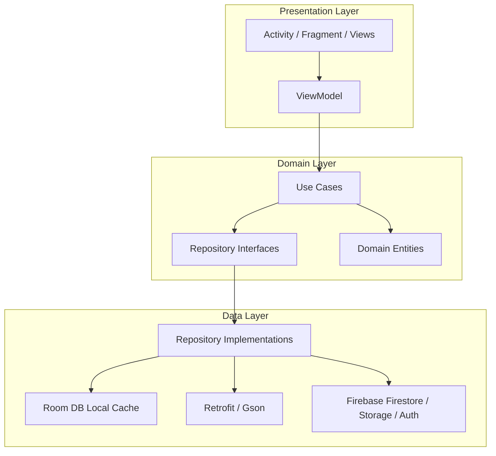

# 🛒 NexCart

NexCart is a premium, feature-rich Android e-commerce application designed with modern development practices. It is built using **Kotlin**, **MVVM architecture**, and **Clean Architecture** principles, ensuring high performance, maintainability, and scalability. The app integrates **Firebase (Authentication, Firestore, Storage)**, **Room Local Database** for offline-first caching, **Retrofit** for third-party product integration, and **Dagger Hilt** for dependency injection.

---

## 🚀 Key Features

### 🔐 Robust User Authentication
*   **Email & Password Login/Registration**: Traditional onboarding powered by Firebase Authentication.
*   **Google Sign-In**: Quick authentication using the new AndroidX Credentials API and Play Services.
*   **Role-Based Access Control**: Users can sign up as a **Buyer** or a **Seller**, unlocking personalized screens and dashboards.
*   **Security & Cloud Sync**: User profiles are stored in Cloud Firestore and synced securely.

### 🛍️ Buyer Experience
*   **Dynamic Product Discovery**: Browse recommended items loaded from external sources (FakeStore API) and products posted by sellers.
*   **Advanced Filtering**: Filter items by category (via dynamic Material Design Chips) and price ranges (using a modern range slider in the sidebar).
*   **Real-time Search**: Search bar with integrated search views that support instant results.
*   **Interactive Details View**: In-depth view for each item showing description, ratings, price, and high-quality image galleries.
*   **Offline Favorites/Wishlist**: Save favorite products to a local wishlist stored inside a Room database, accessible completely offline.

### 💼 Seller Dashboard
*   **Product Management**: Sellers have a dedicated dashboard to list new products, update current inventory, or delete listings.
*   **Multi-Image Uploads**: Select multiple images from the Camera or Gallery using an image picker bottom sheet.
*   **Cloud Media Hosting**: Images are uploaded in the background directly to Firebase Storage.
*   **Catalog Sync**: Auto-syncs seller modifications to Firestore for all buyers to see in real-time.

### 🎨 Material 3 Design & Aesthetics
*   **Edge-to-Edge UI**: Sleek layout implementation adjusting dynamically to system bars and IME (keyboard) window insets.
*   **Theme Toggle**: Support for light and dark modes with a simple toggle switch inside the navigation drawer.
*   **Micro-interactions**: Ripple effects, collapsing toolbars, dynamic drawer, and status-aware chip indicators.

---

## 📐 Architecture Overview

NexCart utilizes **Clean Architecture** combined with **MVVM (Model-View-ViewModel)** to separate concerns and make the codebase highly testable.



### Layer Breakdown:
1.  **Presentation (`/ui`)**: Implements view components (Fragments, Activities, Custom XML layouts) using **ViewBinding**. ViewModels publish state flows gathered from Use Cases.
2.  **Domain (`/domain`)**: Contains pure business logic. Includes model definitions (`Product`, `User`, `Rating`), repository interfaces, and use cases (e.g. favorite/product management).
3.  **Data (`/data`)**: Implements repositories. Manages data operations between the Firestore database, Local Room DB (for caching and favorites), and Retrofit (network operations).
4.  **DI (`/di`)**: Hilt modules configuring injections for databases, APIs, network clients, Firebase instances, and repository implementations.

---

## 📂 Package Directory Structure

```text
com.example.nexcart
│
├── data
│   ├── api          # Retrofit endpoints (FakeStoreApi)
│   ├── local        # Room Database, DAOs, and Type Converters
│   ├── model        # Data transfer objects (DTOs)
│   ├── remote       # Remote services configurations
│   └── repository   # Concrete implementations of Domain Repository interfaces
│
├── di               # Dependency Injection Modules (Dagger Hilt)
│
├── domain
│   ├── model        # Pure Domain models (Product, User, Rating)
│   ├── repository   # Repository interfaces
│   └── usecase      # Feature-specific use cases
│
├── ui               # ViewBinding & Architecture components
│   ├── auth         # Login, Register, ViewModels & Events
│   ├── detail       # Product details view
│   ├── favorites    # User Wishlist view
│   ├── home         # Buyer feeds, Fragment setup
│   ├── homeScreens  # Grid lists & adapter setups
│   └── seller       # Seller Dashboard, Add product UI
│
└── utils            # Extensions, helpers, and constant utilities
```

---

## 🛠️ Technology Stack & Libraries

| Technology | Purpose | Description |
| :--- | :--- | :--- |
| **Kotlin** | Language | Core development programming language. |
| **Jetpack ViewBinding** | View Binding | Type-safe references to layout files. |
| **Navigation Component** | Routing | Core single-activity routing with SafeArgs. |
| **Room Database** | Cache & Local DB | Offline persistence for favorites and product items. |
| **Firebase Auth** | Identity | Secure email/password and Google credentials login. |
| **Firebase Firestore** | Remote DB | Cloud-hosted NoSQL database for products and users. |
| **Firebase Storage** | Media Storage | Storing uploaded seller product images. |
| **Retrofit + Gson** | Networking | API communication with FakeStore REST backend. |
| **Glide** | Image Loading | High-performance image loading, resizing, and caching. |
| **Dagger Hilt** | DI | Simplified compile-time dependency injection. |
| **Coroutines + Flow** | Asynchrony | Asynchronous operations and reactive stream pipelines. |

---

## 📝 Database Schema (Local Cache)

NexCart uses a Room Database with two main tables:
1.  **`ProductEntity`**: Caches remote and seller products locally to support offline reading.
2.  **`FavoriteProductEntity`**: Stores products added by the user to their favorites.

A customized `StringListConverter` is registered to support serializing/deserializing string lists (`images`) into a JSON representation for Room storage compatibility.

---

## ⚙️ Setup and Installation

Follow these instructions to run the project locally in Android Studio:

### Prerequisites
*   Android Studio **Koala** (2024.1.1) or newer.
*   **JDK 17** configured in your IDE settings.
*   An Android Device or Emulator running **API Level 34 (Android 14)** or newer.

### Steps
1.  **Clone the Repository**:
    ```bash
    git clone https://github.com/Shreyash414/Nexcart.git
    cd Nexcart
    ```

2.  **Add Firebase Configuration**:
    *   Create a new project in the [Firebase Console](https://console.firebase.google.com/).
    *   Enable **Authentication** (Email/Password & Google providers).
    *   Enable **Cloud Firestore** and **Cloud Storage**.
    *   Register your Android application using application ID `com.example.nexcart`.
    *   Download your generated `google-services.json` and place it in the `app/` directory of the cloned project.

3.  **Build and Sync**:
    *   Open the project in Android Studio.
    *   Let Gradle sync finish downloading dependencies.
    *   Click **Run** (`Shift + F10` or click the play button) to deploy the app on your emulator or connected device.
